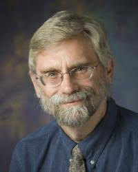

## 1st International Workshop on Security and Privacy for the Internet-of-Things (IoTSec)

### _to be co-located with the <a href="http://conferences.computer.org/IoTDI/" target="_blank">3rd ACM/IEEE International Conference on Internet of Things Design & Implementation (IoTDI) 2018</a>, in Orlando, Florida, USA._

> **_News (03/30/2017): Full workshop program available!_**

> **_News (03/30/2017): Keynote speaker:  <a href="http://web.engr.illinois.edu/~dmnicol/" target="_blank">Dr. David Nicol</a>, University of Illinois_. Talk: The Role of Modeling and Simulation in IOT Security Research**

<!-- > **_News (03/12/2017): Keynote speaker:  <a href="http://web.engr.illinois.edu/~dmnicol/" target="_blank">Dr. David Nicol</a>, University of Illinois_. Talk: [TBD]** -->

<!-- > **_Update (03/11/2017): List of accepted papres are now available <a href="acceptedpapers_18/acceptedpapers.html" target="_blank">[here]</a>_** -->

<!-- > **_Update (03/09/2017): Camera ready papers are due by March 19, 2018 [11:59 PM GMT-12])_** -->

<!-- > **_Update (01/25/2017): Deadline Extended to Feb 08, 2018 (GMT-12)_** -->

The Internet-of-Things (IoT) has taken off in a big way and finds itself embedded in our daily lives – from smart home applications to process control monitoring in manufacturing systems, wearables to healthcare, public utilities to military applications, to name just a few. The surge in interest in smart cities increases the scope and reach of IoT-style applications in a significant manner. These applications generate huge volumes of data, have access to personal and confidential information, monitor and control critical processes and are often accessed/controlled via public networks such as the Internet. Hence, they are prime targets for malicious entities and have little to no security mechanisms in place. In addition, most users of such devices/systems are not cognizant of the privacy issues – leakage of personal information for instance, or external entities being able to retrace/recreate our activities from public data obtained through the use of IoT devices/services. On the other hand, onerous security and privacy mechanisms may render these systems useless for most consumers. Hence, there is a need to develop innovative techniques to improve protections for such systems. This is particularly challenging since many IoT systems are often limited in terms of computation power, memory, battery life, bandwidth, etc.

Hence, the goal of IoTSec will be to bring together experts in various areas (security, privacy, embedded systems, sensor networks, etc. along with domains experts from medicine, manufacturing systems, mobile devices and so on) to study and develop security and (usable) privacy mechanisms for next generation IoT systems.

* * *

### Keynote: Prof. David M. Nicol, Univeristy of Illinois at Urbana-Champaign

#### **Title: The Role of Modeling and Simulation in IoT Security Research**

**_Abstract:_**
_Many of the challenges of security in IOT relate to scale.  How do we
discover what scaling problems exist?  How do we evaluate solutions to the
problems we foresee?  While measurement of many many IoT devices concurrently
may be possible, what sense can we make of the measurements when so much of 
the IoT infrastructure is opaque to us?  There is a role for modeling and simulation
in assessing security problems and solutions.  This talk highlights the opportunities
and identifies the associated challenges._
* * *

<!-- -->

{:style="float: left;margin-right: 15px;margin-top: 0px; margin-left: 0px;"}

**Speaker Bio:**
David M. Nicol is the Franklin W. Woeltge Professor of Electrical and Computer Engineering at the University of Illinois at Urbana‐Champaign, and Director of the Information Trust Institute (iti.illinois.edu). He is PI for two national centers for infrastructure resilience: the DHS‐funded Critical Infrastructure Reliance Institute (ciri.illinois.edu), and the DoE funded Cyber Resilient Energy Delivery Consortium (cred‐c.org); he is also PI for the Boeing Trusted Software Center, and co-PI for the NSA‐funded Science of Security lablet.  Prior to joining UIUC in 2003 he served on the faculties of the computer science departments at Dartmouth College (1996‐2003), and before that the College of William and Mary (1987‐1996).  He has won recognition for excellence in teaching at all three universities. His research interests include trust analysis of networks and software, analytic modeling, and parallelized discrete‐event simulation, research which has led to the founding of startup company Network Perception, and election as Fellow of the IEEE and Fellow of the ACM. He is the inaugural recipient of the ACM SIGSIM Outstanding Contributions award, and co‐author of the widely used undergraduate textbook "Discrete‐Event Systems Simulation". 
* * *

### Program

* * *
8:30 AM -- 8:45 AM   _Welcome Remarks_
 
 
8:45 AM -- 9:45 AM   _Keynote: "The Role of Modeling and Simulation in IoT Security Research"  
		   	    Prof. David M. Nicol, 
			    Univeristy of Illinois at Urbana-Champaign_
 
 
9:45 AM -- 10:00 AM   _Q & A_
* * *
**10:00 AM -- 10:30 AM**  **COFFEE BREAK**
* * *
#### Session I: Attacks and Defenses
10:30 AM -- 10:50 AM  
_Yuan Gong and Christian Poellabauer. An Overview of Vulnerabilities of Voice Controlled System_
 
 
10:50 AM -- 11:10 AM   
_Abhinav Mohanty, Islam Obaidat, Fadi Yilmaz and Meera Sridhar. Control-hijacking Vulnerabilities in IoT Firmware: A Brief Survey_
 
 
11:10 AM -- 11:30 AM   
_Daniel Sanchez and Bogdan Copos. Cognitive Enhancement as an Attack Surface_
 
 
11:30 AM -- 11:50 AM  
_Hui Lin. SDN-based In-network Honeypot: Preemptively Disrupt and Mislead Attacks in IoT Network_
 
 
11:50 AM -- 12:10 PM  
_Chen Cao, Le Guan, Peng Liu, Neng Gao, Jingqiang Lin and Ji Xiang. Hey, You, Keep away from My Device: Remotely Implanting a Virus Expeller to Defeat Mirai on IoT Devices_
* * *
**12:10 PM -- 1:30 PM** 
**LUNCH BREAK**
* * *
#### Session II: Causality, Redaction and Legal frameworks
1:30 PM -- 1:50 PM  
_Ioannis Agadakos, Gabriela Ciocarlie, Bogdan Copos, Tancrede Lepoint, Ulf Lindqvist and Michael Locasto. Butterfly Effect: Causality from Chaos in the IoT_
 
 
1:50 PM -- 2:10 PM  
_Soteris Demetriou, Nathaniel D. Kaufman, Jonah Baim, Adam J. Goldsher and Carl A. Gunter. Toward an Extensible Framework for Redaction_
 
 
2:10 PM -- 2:30 PM  
_Sudip Vhaduri and Christian Poellabauer. Implicit Authentication in Wearables Using Multiple Biometrics_
 
 
2:30 PM -- 2:50 PM  
_Andrew Weyl and George Williamson. A Multinational Legal Examination of Individual Security Risks Related to the Internet of Things_

* * *
**2:50 PM -- 3:30 PM** 
**COFFEE BREAK**
* * *
#### Session III: IoT Security Architectures

3:30 PM -- 3:50 PM  
_Giovani Gracioli, Murray Dunne and Sebastian Fischmeister. A Comparison of Data Streaming Frameworks for Anomaly Detection in Embedded Systems_
 
 
3:50 PM -- 4:00 PM  
_Safa Boudabous, Stephan Clémençon, Ons Jelassi and Mariona Caros Roca. A secure IoT architecture for streaming data analysis and anomaly detection_
 
 
4:10 PM -- 4:30 PM  
_Ebelechukwu Nwafor, Andre Campbell and Gedare Bloom. Anomaly-based Intrusion Detection of IoT Device Sensor Data using Provenance Graphs_
 
 
4:30 PM -- 4:50 PM  
_Hamed Haddadi, Vassilis Christophides, Renata Cruz Teixeira, Kenjiro Cho, Shigeya Suzuki and Adrian Perrig. SIOTOME: An Edge-ISP Collaborative Architecture for IoT Security_
 
 
4:50 PM -- 5:00 PM  
_Concluding Remarks_

* * *
**6:00 PM -- 8:00 PM**
**RECEPTION**
* * *
 

### Areas of Interest

The areas of interest for the workshop includes, but is not limited to, the following:
  - Classification of the threats faced by IoT systems
  - Problems with privacy of data generated by IoT devices/systems
  - Security and privacy solutions and frameworks for (a) legacy IoT systems and (b) future IoT services
  - Novel architectures that improve the security and privacy of such devices
  - Understanding of social issues that increase the adoption of privacy mechanisms in IoT devices
  - Communication protocols & architectures that improve security and privacy
  - Lightweight cryptography algorithms for use in IoT systems
  - Privacy-preserving computation models that can run on limited resources available to IoT devices
  - Machine learning for security of IoT devices/services
  - Modeling, verification and formal methods for security methods for the IoT domain
  - Security and privacy of the cloud infrastructure for IoT

### Improtant Dates
  - Submission deadline: **~~Feb 1, 2018~~** **Feb 8, 2018 anywhere on Earth (GMT-12)**
  - Notification of acceptance: **~~March 6, 2018~~** **March 8, 2018**
  - Final (camera-ready) papers due: **~~March 11, 2018~~** **March 19, 2018 [11:59 PM GMT-12]**

### Submission Guideline

  All papers must be original and not simultaneously submitted to another journal or conference. The following paper categories are welcome:
  - Papers describing original research in the area of security and privacy for Internet-of-Things (IoT).

  Submissions limited to **four**, **two column**, pages

  _**Template:** <a href="https://www.ieee.org/conferences_events/conferences/publishing/templates.html" target="blank">https://www.ieee.org/conferences_events/conferences/publishing/templates.html </a>_

_**Submission site:** <a href="https://easychair.org/conferences/?conf=iotsec2018" target="blank">https://easychair.org/conferences/?conf=iotsec2018 </a>_

### Organizers
  -
  <a href="http://sibin-research.blogspot.com/" target="_blank">Sibin Mohan</a>, University of Illinois at Urbana-Champaign (UIUC)
  -
  <a href="http://elaineshi.com/" target="_blank">Elaine Shi</a>, Cornell University

### Technical Program Committee
  - Sean Smith, Dartmouth College
  - Gedare Bloom, Howard University
  - Gabriela Ciocarlie, SRI International    
  - Miroslav Pajic, Duke University
  - Bryan Ward, MIT Lincoln Laboratory
  - Dawn Schrader, Cornell University
  - Daniel Mosse, University of Pittsburgh
  - Mu Zhang, Cornell University
  - Siddharth Garg, NYU
  - Rakesh Kumar, University of Illinois at Urbana-Champaign
  - Rakesh Bobba,	Oregon State University
  - Ramya Raghavendra, IBM Research
  - Man-Ki Yoon, Yale University
  - Henry Duwe, Iowa State University
  - Negin Salajageh, Visa Research
  - Adam Bates,	University of Illinois at Urbana-Champaign
  - Bo Li, University of California, Berkeley
  - Ing-Ray Chen, Virginia Tech 

### Web Chair
  - Monowar Hasan, University of Illinois at Urbana-Champaign

<!-- Markdown cheatsheet
- Bulleted
- List
1. Numbered
2. List
**Bold** and _Italic_ and `Code` text
[Link](url) and 
## Header 2
### Header 3 -->

<!-- past [past](./pastworkshops/index.md) -->
